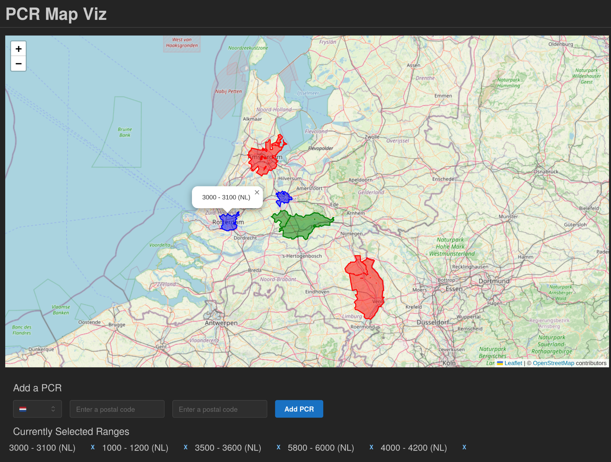

# Postal Code Area Visualizer

This is a simple web application that visualizes the postal code ranges of a given country on a map.

**Visualization features built using:**

- [Leaflet](https://leafletjs.com/) for the map
- [GeoJSON](https://geojson.org/) for postal code data
- [Turf.js](https://turfjs.org/) for unioning polygons

**UI is built with:** [React](https://reactjs.org/) & [Mantine](https://mantine.dev/)

## Countries Supported

- [x] Netherlands
- [x] Belgium
- [x] Germany

## Improvements

- [ ] Add better postal code picker
- [ ] Add region selection based on other GeoJSON properties
- [ ] Offload heavy calculations to a service worker to not block the UI
- [ ] Cache GeoJSON data locally to avoid fetching it every time
- [ ] Turn into a standalone component that can be easily integrated into other projects

## Development

Uses Git LFS for storing GeoJSON files. Make sure to install it from [here](https://git-lfs.com/) before cloning the repository.
